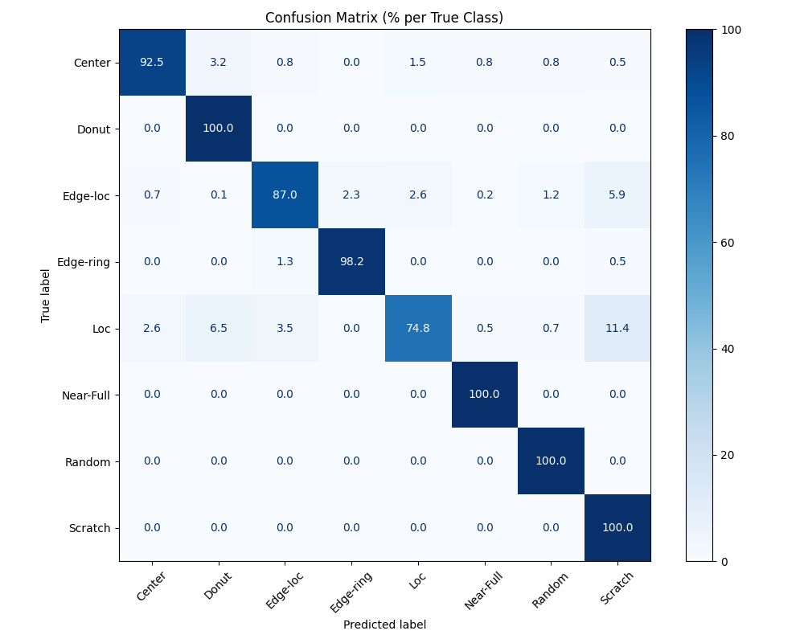

# Wafer Defect Classifier using Convolutional Neural Network

## 1. Project Overview
A deep learning project to classify defects in **silicon wafer images** using Convolutional Neural Networks (CNNs) built with **PyTorch**. The model learns from labeled defect images and predicts one of the following 9 defect types.

| Class       | Description                              |
|-------------|------------------------------------------|
| Center      | Defects clustered near the center        |
| Donut       | Ring-shaped defect patterns              |
| Edge-Loc    | Defects localized near wafer edge        |
| Edge-Ring   | Circular band near the edge              |
| Loc         | Localized defect cluster                 |
| Near-full   | Defects spread across almost the entire wafer |
| Random      | Sparse and random defect locations       |
| Scratch     | Line-shaped scratches                    |
| none        | No clear pattern / normal wafer          |

The Datset(provided by https://www.kaggle.com/code/ram510/wafer-defect-classification) was divided into following 3 folders:
| Class       | Purpose                                  |
|-------------|------------------------------------------|
| train       | Learn Model Parameters.                  |
| val         | Tune hyperparameters, monitor overfitting|
| test        | Final unbiased performance evaluation    |

*Note: The dataset images are too large to be uploaded, but can be downloaded from the link above.

---

## 2. Motivation

This project was to familarize Deep Learning Algorithm: CNN used for Computer Vision.
As a former Materials Engineer, one of the key processes in wafer production is to identify the possible defects on the silicon, which can affect the functionalities of the final product. As a current Software Engineer, I have incorporated the computer vision technique to solve the critical struggles I have experienced in the past.

---

## 3. Convolutional Neural Network (CNN)
A convolutional neural network (CNN or ConvNet) is a type of deep learning algorithm specialized in processing grid-like data such as images, enabling computers to recognize patterns, objects, or classes within that data. CNNs are especially powerful for tasks in image classification, object detection, and even extend to fields like audio, time-series, and natural language processing.

Essentially, a CNN is composed of several types of layers:
- Convolutional Layers: Apply small filters (kernels) that scan across the input data (like image pixels), extracting simple features such as edges and gradually learning more complex patterns deeper in the network. The filters are shared across the entire input, which helps capture local spatial structure and reduces the number of parameters to be learned.
- Activation Layers (often ReLU): Introduce nonlinearity by mapping all negative values to zero, which helps the network to model complex relationships.
- Pooling Layers: Downsample the data, summarizing regions to make feature maps smaller and the model more robust to small shifts and distortions. Common pooling methods include max pooling and average pooling.
- Fully Connected Layers: At the end, these layers integrate the features learned by previous layers to output the final prediction (such as the class of an object in an image)

---

## 4. Final Output
The final output to compare the True data vs. Predicted data is depicted using the confusion matrix.

#Note: A confusion matrix is a table used to evaluate the performance of a classification model by comparing the model’s predicted values with the actual values from the dataset. Each row of the matrix represents instances of an actual class, while each column represents instances of a predicted class—or vice versa, depending on convention.

#### Confusion Matrix
  

---

## 5. Future Implementation
This project was performed with traditional CNN. In a near future, to improve the efficiency/accuracy, other algorithms including Vision Transformers(ViT) and Capsule Networks should be studied for comparison. Furthermore, this project was performed with wide variety of data sizes between each type of defects, raning from 200 to 10,000. To generate a more precise outcome, larger and similar data set size is in need.